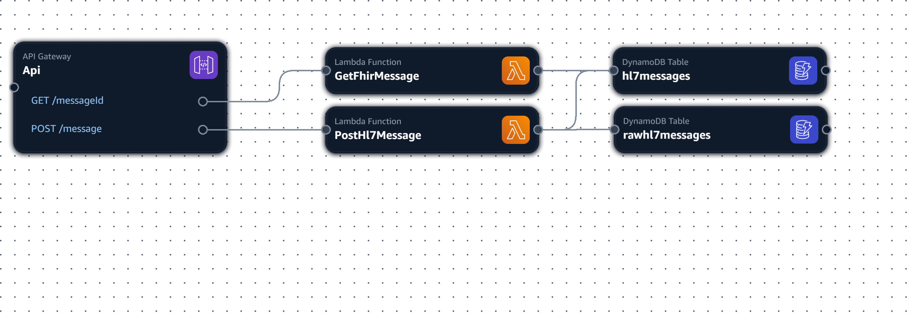
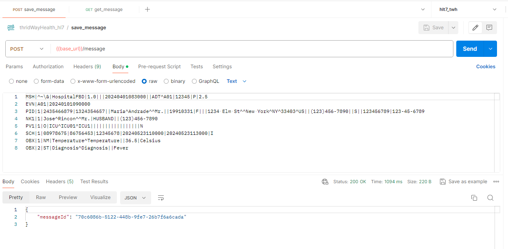
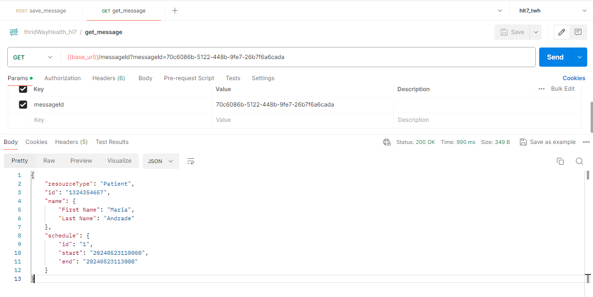

# hl7-fhir-parser

* The pourpoise is to provide a couple of lambda functions to implement a HL7 message parser to retrieve data in FHIR format.
* The pipeline considered in this case will hav an API Gateway, two AWS lambda services and two DynamoDB tables.
* Although the messages could be send through AWS SQS services and just use the API to retrieve the message in FHIR format, or even be located in a S3 bucket.

## Initial Considerations:
* The parser was created for ADT HL7 messages, or any other type that has 'PID' and 'SCH' segments.
* Also, notice that the parser irself it's a hard coding one, it will not use any dedicated library.
* You can find a CloudFormation template in [JSON](cloudFormation/template.json) or in [YMAL](cloudFormation/template.yaml), but use those just as guide, they don't consider the complete pipeline.
* The Cloudformation template was obtain through the AplicationComposer from CloudFormation, and that's way is not recommended use that template, because was just created to get a pipeline diagram, so doesn't consider policies, roles and IAM permissions that need to be granted.
* There are a couple of ADT HL7 message example on the [ADT_Messages folder](ADT_Messages) but those ones are fictial data, and even maybe could not be consider as ADT in fact, but can give you an idea of what to expect in terms of estrcutre for HL7 messages.
* Finally, the AWS Lambdas will be handle for three scripts, that has the exactly same name, and even the `logic` behind every one is pretty similar.

## Kind of step-by-step
Although the pourpoise is to show the hard-coding parser created for HL7 messages and retrieve a FHIR formated message, let's take a look to the pipeline building part.
* First create two DynamoDB tables, one to save the message parsed and the other one to save the raw data message, make sure that both tables have the same 'key', in this case we will use `messageId`.
* Second, create the lambda function that will be triggered by the `POST` method from the API. When call, the [lambda function](POST/lambda_function.py) will parse the message with the [adt_parser](POST/adt_parser.py) that will use the [validation](POST/validation.py) script. Has mentioned before, this is a hard-coding parser, so it doesn't have too much validations, but could be added as you gain experience with the HL7 format an its needs.
* Notice that the scripts mentioned doesn't parser the message to a FHIR format directly, it will create a dictionary that will be stored with a messageId in a DynamoDB table, and also that this lambda function will save the raw message.
* Third, create the [lambda function](GET/lambda_function.py) that will retrieve the data from the DynamoDB table, and will be here when the data will be parsed as FHIR format with the [adt_parser](GET/fhir_parser.py) and will also be validate by a [validate](GETT/validation.py) script.
* Finally, created the API Gateway, we just used a HTTP API with the both methods mentioned attached to every specific lambda function, but could be a further improvment consider the deletion, update or modify part of the message as options.

## The pipeline and the responses from the API endpoint:
* As was mentioned before, the pipeline are just an API with two methods, two lambda functions and two DynamoDB tables:

* The response from the POST method, that return the messageId:

* The responser from the GET method, that return the message in FHIR format.

## Final considerations:
* There were not existed experience working with HL7 messages before, or with the FHIR format, so this is a first approach, and even say that could be an exageration.
* The process fo parse HL7 messages could be as detailed as needed, but always knowing what is permited, what make sense, what is stablished and what is expected; just for an example, if you detail the "validate" scripts you'll find that the date field were evaluated just for digits, is that enough? From there should be go further in this development.
* At the same time, go in a deeply detailed "validation" could be mean a complex challenge, 'cause any field, of any segment could be represent an eternal "what would be the right way", and maybe there already some packages that handle most of the cases. (a founded example [HL7apy](https://crs4.github.io/hl7apy/index.html))
* The AWS services could be as much as overwalming, and here was just presented a simple pipeline, but we could use S3 for the storage of the raw data, trigger a lambda that execute some job with the parser solution and update some XML to view the data, maybe recieve the data through SQS services.
* We just handle a single message, what happend when there a hundred or thousand of them, it is optimal to use lambda if its cost is based on invokes? Will be better consider a permanent instance?

### Resources used:
* **Python version:** 3.8
* **Packages:** json, boto3, uuid, loggin, re
* **AWS services** API Gateway, lambda function, DynamoDB - Also was created a Role its policy and permissions attached.
